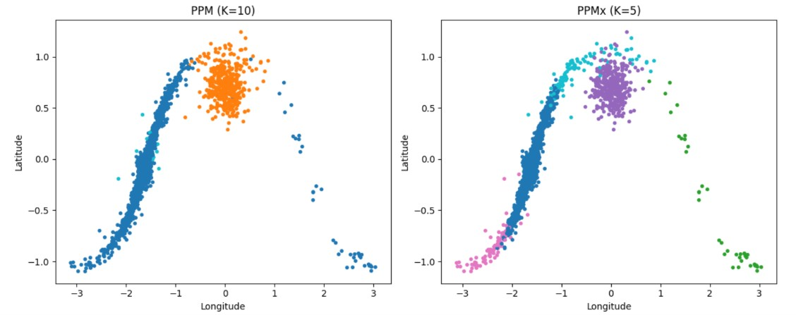
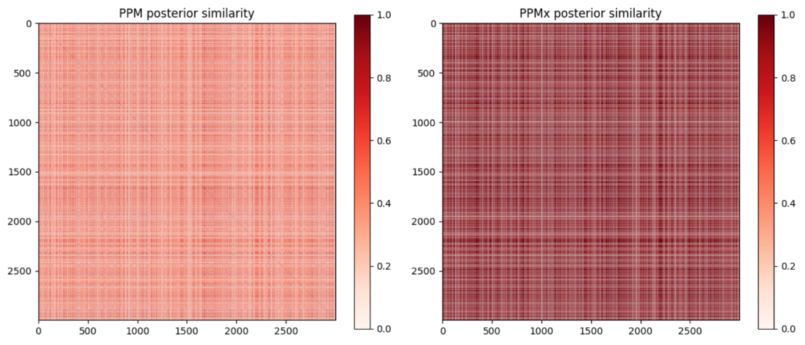

# Bayesian Clustering with Exogenous Information 🌌
> **Gibbs Sampler Implementation for PPMx Models on LISA Gravitational Wave Data**

## Project Overview
This repository contains the final project for the Bayesian Statistics course held at Politecnico di Milano in the academic year 2025-2026.
This project explores **Bayesian Nonparametric** clustering to identify structural components of the Milky Way. We implement a **Product Partition Model with Covariates (PPMx)** to cluster Double White Dwarf (DWD) systems using gravitational wave signals from the LISA Mission.

The core innovation is "clustering clusters": using exogenous information (covariates) to guide the partition of observations into physically meaningful groups.

## Methodology: PPMx & Gibbs Sampling
The core of this work is a custom **Collapsed Gibbs Sampler** built from scratch in Python.
* **Model:** Product Partition Model (PPM) with a **Pitman-Yor Process** prior.
* **Innovation:** Implementation of **PPMx**, where the prior on the partition is informed by covariate similarity.
* **Algorithm:** Custom **Gibbs Sampler** (collapsed) implemented from scratch in Python.
* **Inference:** Partition estimation via **Binder's Loss function** and uncertainty analysis using **Posterior Similarity Matrices (PSM)**.

## Mathematical Framework
For a detailed derivation of the algorithm, please refer to the [Mathematical Framework](docs/Mathematical_Framework.pdf).

## Key Results
### PPM vs PPMx Comparison
The inclusion of covariates (ecliptic coordinates) allows the model to better resolve the spatial structure of galactic sources compared to a standard model.

*Left: Standard PPM (observations only). Right: PPMx (observations + covariates).*

### Posterior Uncertainty
We evaluated the stability of our clusters using entropy and similarity matrices to ensure MCMC convergence and partition reliability.

*Posterior Similarity Matrix showing the probability of pair-wise clustering.*

## 🌌 Dataset: LISA Mission
* **Context:** Data from the Laser Interferometer Space Antenna (LISA) mission.
* **Scale:** Original dataset of **32 Million observations**.
* **Analysis:** Conducted on a randomly extracted subsample of **3,000 points** to ensure MCMC convergence while preserving galactic density structures.
* **Features:** Initial frequency ($f_0$), frequency derivative ($\dot{f}$), and ecliptic coordinates ($b, l$).

## Repository Structure
* [`notebooks/`](notebooks/): Detailed Python implementation and exploratory data analysis.
* `docs/`:
   * [`Mathematical_Framework.pdf`](docs/Mathematical_Framework.pdf): Detailed derivation of NIW conjugacy and Gibbs steps.
   * [`BS_Report.pdf`](docs/BS_Report.pdf): Full academic report.
   * [`BS_Slides.pdf`](docs/BS_Slides.pdf): Presentation deck.
* [`images/`](images/): Visualizations of results and model diagnostics.

----

## Authors
- [Alessio Pani](https://www.linkedin.com/in/alessio-pani-8739b93bb)
- Ileana Atena
- Serife Zeynep Erbaysal
- Luca Montalto
- Pinar Nur Ozkaplan
- Giulia Steiner
